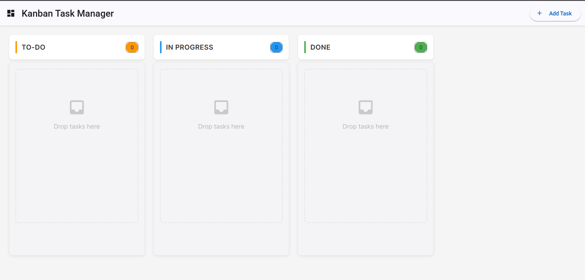
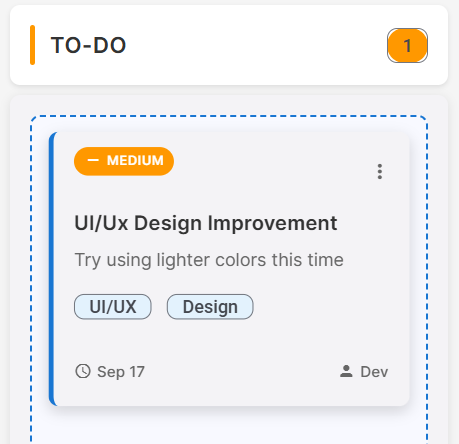

# MILESTONE 1: Core Kanban System Implementation

<div align="center">


**Date:** September 16, 2025

</div>

---

## 📋 **Project Overview**

A modern, responsive web-based Kanban task management system built with Angular 17+ and Material Design. Features drag-and-drop functionality, comprehensive CRUD operations, and a clean, intuitive user interface designed for productivity and scalability.

### **Core Objectives Achieved**

- ✅ **Responsive UI/UX** with Material Design principles
- ✅ **Full CRUD Operations** for task management
- ✅ **Angular CDK Drag & Drop** implementation
- ✅ **Reactive Forms** with comprehensive validation
- ✅ **Service-based Architecture** with RxJS observables
- ✅ **Component-based Design** with reusable modules

---

## **Technical Architecture**

### **Frontend Stack**

```typescript
{
  "framework": "Angular 17+",
  "language": "TypeScript 5.0+",
  "ui_library": "Angular Material 17",
  "drag_drop": "Angular CDK",
  "state_management": "RxJS BehaviorSubject",
  "forms": "Reactive Forms",
  "styling": "Material Design + Custom CSS",
  "icons": "Material Icons"
}
```

### **Project Structure**

```
src/app/
├── components/           # UI Components
│   ├── kanban-board/    # Main board layout
│   ├── task-card/       # Individual task display
│   ├── add-task-dialog/ # Task creation modal
│   ├── edit-task-dialog/# Task editing modal
│   └── column-header/   # Column titles & counters
├── services/            # Business Logic
│   └── task.service.ts  # State management & CRUD
├── models/              # TypeScript Interfaces
│   └── task.model.ts    # Data models & enums
└── shared/              # Shared Modules
    └── material.module.ts # Material imports
```

---

## **Component Implementation Details**

### **1. KanbanBoardComponent**

> **Purpose:** Main container orchestrating the entire Kanban workflow

**Technical Features:**

- **Drag & Drop Integration:** Angular CDK `DragDropModule` with `CdkDropList`
- **State Management:** Subscribes to `TaskService.columns$` observable
- **Event Handling:** `drop()` method manages task transfers between columns
- **Responsive Design:** CSS Grid layout with Material Card containers


_Full Kanban board layout with three columns showing the complete implementation_


_Clean empty board state ready for task creation_

**Key Methods:**

```typescript
drop(event: CdkDragDrop<Task[]>): void {
  // Handles inter-column task movement
  // Updates task status based on target column
  // Triggers service state updates
}
```

### **2. TaskCardComponent**

> **Purpose:** Reusable component for individual task display and interaction

**Technical Features:**

- **Input Properties:** `@Input() task: Task` for data binding
- **Output Events:** `@Output() editTask`, `@Output() deleteTask`
- **Material Components:** `mat-card`, `mat-chip`, `mat-icon`
- **Priority Visualization:** Color-coded priority indicators
- **Action Buttons:** Edit/Delete with Material Design icons


_Individual task card showing priority indicators, content, and action buttons_

**Component Interface:**

```typescript
@Component({
  selector: 'app-task-card',
  inputs: ['task'],
  outputs: ['editTask', 'deleteTask']
})
```

### **3. AddTaskDialogComponent**

> **Purpose:** Modal dialog for creating new tasks with comprehensive validation

**Technical Features:**

- **Material Dialog:** `MatDialogRef<AddTaskDialogComponent>`
- **Reactive Forms:** `FormBuilder` with validators
- **Form Validation:** Required fields, min/max length constraints
- **Date Picker:** Material datepicker for due dates
- **Priority Selection:** Dropdown with enum values


_Add Task dialog with comprehensive form fields and validation_


_Successful task creation showing the new task in the board_

**Form Structure:**

```typescript
taskForm = this.fb.group({
  title: ["", [Validators.required, Validators.minLength(3)]],
  description: ["", [Validators.required]],
  priority: [TaskPriority.MEDIUM, Validators.required],
  dueDate: [null],
  assignee: [""],
});
```

### **4. EditTaskDialogComponent**

> **Purpose:** Advanced modal for editing existing tasks with change detection

**Technical Features:**

- **Pre-populated Forms:** Dynamic form value initialization
- **Change Detection:** `hasFormChanged()` method for dirty checking
- **Status Management:** Status dropdown with visual indicators
- **Vertical Scrolling:** Optimized for mobile with `max-height: 65vh`
- **Form Persistence:** Prevents accidental data loss


_Edit Task dialog with pre-populated data and status management_

**Advanced Features:**

```typescript
hasFormChanged(): boolean {
  const formValue = this.taskForm.value;
  return JSON.stringify(formValue) !== JSON.stringify(this.originalTask);
}
```

### **5. ColumnHeaderComponent**

> **Purpose:** Column titles with dynamic task counters and status indicators

**Technical Features:**

- **Dynamic Counters:** Real-time task count updates
- **Status Mapping:** Maps TaskStatus enum to display names
- **Material Typography:** Consistent heading styles
- **Responsive Text:** Adaptive font sizes for mobile


_Column header showing title, task counter, and clean Material Design styling_

---

## 💾 **Data Management & Services**

### **TaskService Architecture**

> **Central state management using reactive programming patterns**

**Core Features:**

```typescript
class TaskService {
  private columnsSubject = new BehaviorSubject<Column[]>(this.getInitialData());
  public columns$ = this.columnsSubject.asObservable();

  // CRUD Operations
  addTask(task: Task, columnId: string): void;
  updateTask(updatedTask: Task): void;
  deleteTask(taskId: string): void;

  // Query Methods
  getTaskById(taskId: string): Task | null;
  getTasksByStatus(status: TaskStatus): Task[];
  searchTasks(query: string): Task[];
}
```

**State Management Pattern:**

- **Observable Streams:** RxJS BehaviorSubject for reactive updates
- **Immutable Updates:** Spread operators for state immutability
- **Event-driven:** Component communication via service events

### **Data Models**

```typescript
interface Task {
  id: string;
  title: string;
  description: string;
  status: TaskStatus;
  priority: TaskPriority;
  createdDate: Date;
  dueDate?: Date;
  assignee?: string;
  tags?: string[];
}

enum TaskStatus {
  TODO = "todo",
  IN_PROGRESS = "in-progress",
  DONE = "done",
}

enum TaskPriority {
  LOW = "low",
  MEDIUM = "medium",
  HIGH = "high",
}
```

---

## 🎨 **UI/UX Implementation**

### **Material Design Integration**

- **Component Library:** Angular Material 17 with custom theming
- **Color Palette:** Primary (#1976d2), Accent (#4caf50), Warn (#f44336)
- **Typography:** Material Design typography scale
- **Responsive Breakpoints:** Mobile-first design approach

### **Dialog System Enhancements**

- **Header Gradient:** CSS gradients for visual hierarchy
- **Padding Optimization:** `48px` horizontal padding for better spacing
- **Scrollable Content:** Vertical scrolling with styled scrollbars
- **Form Preview:** Real-time form summary for user feedback

### **Animation & Interactions**

- **Drag Feedback:** Visual indicators during drag operations
- **Form Transitions:** Smooth slide-in animations
- **Button Hover Effects:** Material elevation changes
- **Loading States:** Progress indicators for async operations

---

## 🏆 **Milestone 1 Achievement Summary**

### 📊 **Implementation Progress & Component Breakdown**

<div align="center">

| **Category**        | **Progress** | **Components**                                                                                                  |   **Status**    |
| :------------------ | :----------: | :-------------------------------------------------------------------------------------------------------------- | :-------------: |
| **UI Components**   |   **5/5**    | KanbanBoardComponent, TaskCardComponent, AddTaskDialogComponent, EditTaskDialogComponent, ColumnHeaderComponent | ✅ **Complete** |
| **Services**        |   **1/1**    | TaskService (State Management & CRUD Operations)                                                                | ✅ **Complete** |
| **Data Models**     |   **1/1**    | Task Interface, TaskStatus & TaskPriority Enums                                                                 | ✅ **Complete** |
| **CRUD Operations** |   **4/4**    | Create Task, Read Tasks, Update Task, Delete Task                                                               | ✅ **Complete** |

</div>

### 🎯 **Detailed Component Analysis**

| Component                   | Purpose                        | Key Features                                             | Implementation Status |
| :-------------------------- | :----------------------------- | :------------------------------------------------------- | :-------------------: |
| **KanbanBoardComponent**    | Main container & orchestration | Drag & Drop, State Management, Responsive Grid           |          ✅           |
| **TaskCardComponent**       | Individual task display        | Material Cards, Priority Indicators, Action Buttons      |          ✅           |
| **AddTaskDialogComponent**  | Task creation modal            | Reactive Forms, Validation, Material Dialog              |          ✅           |
| **EditTaskDialogComponent** | Task editing interface         | Pre-populated Forms, Change Detection, Status Management |          ✅           |
| **ColumnHeaderComponent**   | Column titles & counters       | Dynamic Counters, Status Mapping, Material Typography    |          ✅           |

---

_Built using Angular 17+, Material Design, and modern web standards_

</div>
